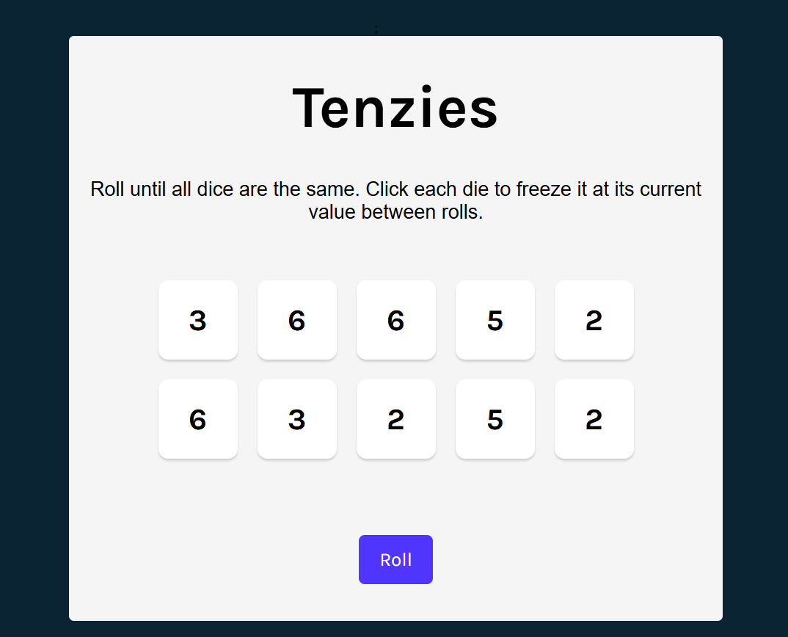
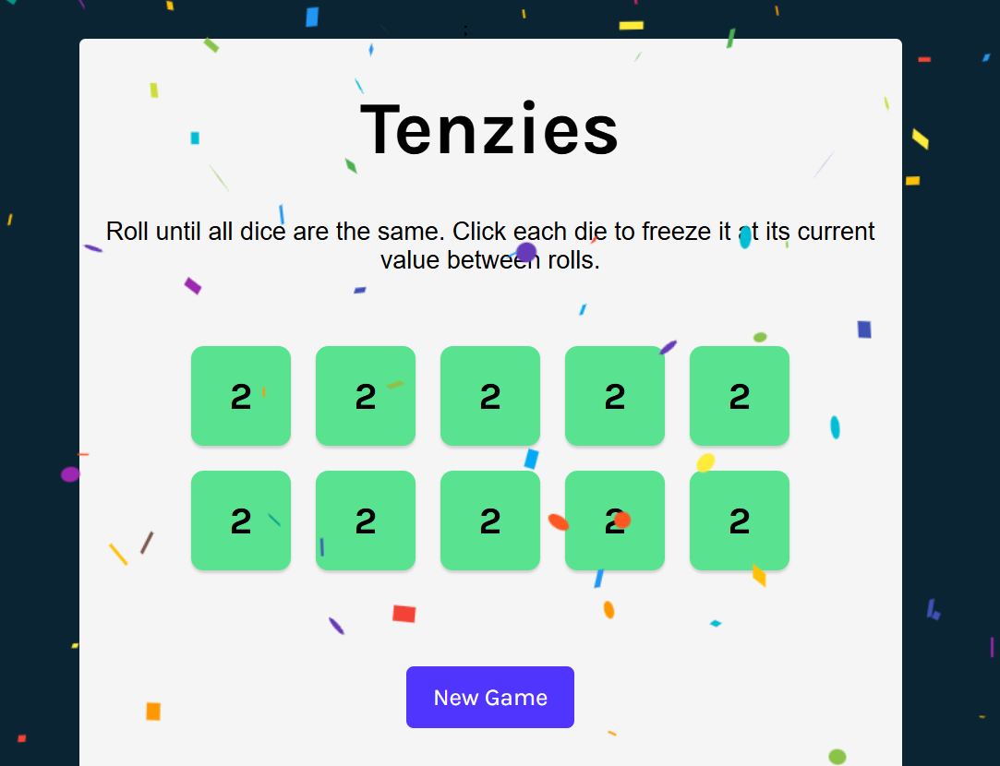

🎲 Tenzies Game in React

This is a React-based implementation of the classic Tenzies game, where the goal is to roll dice until all of them display the same value. Players can "hold" dice to freeze their current values between rolls.

🖥️ Live Demo

Play Tenzies Game [Online](https://chef-claude-recipe.netlify.app).

🚀 Features

Interactive UI: Smooth and user-friendly design built with React.
Game Logic: Players can hold dice, roll again, and win once all dice match.
Celebratory Confetti: Confetti animation appears when you win the game.
Accessibility: Keyboard focus and screen reader announcements for inclusivity.
Responsive Design: The app adapts seamlessly to all screen sizes.

🎮 How to Play

Roll the dice by clicking the "Roll" button.
Click on individual dice to hold their values.
Keep rolling until all dice show the same number.
Once you win, the "New Game" button will appear—play again!

🛠️ Tech Stack

React: Component-based UI development.
CSS Grid & Flexbox: For responsive styling.
React Confetti: For win animations.

🌟 Acknowledgments

The project is inspired by Scrimba’s Tenzies challenge.
Confetti effect powered by react-confetti.

📄 License
This project is open source and available under the MIT License.

Let me know if you'd like to tweak this further! 🚀
